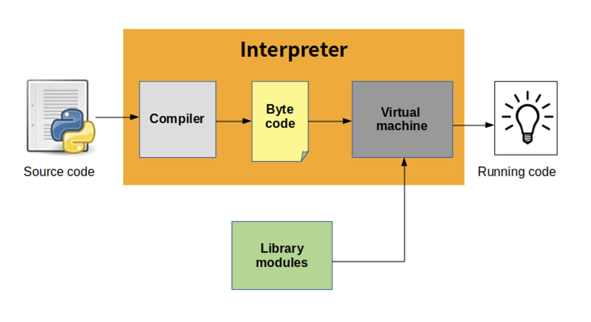
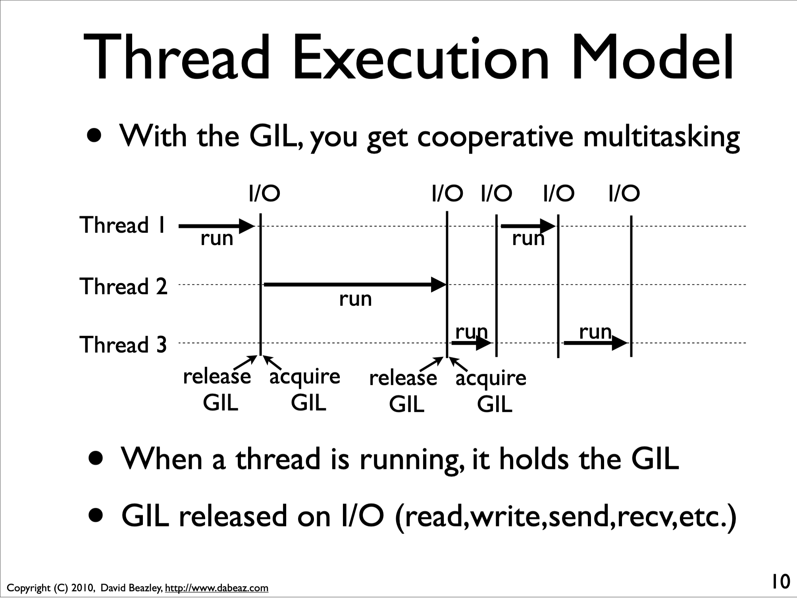
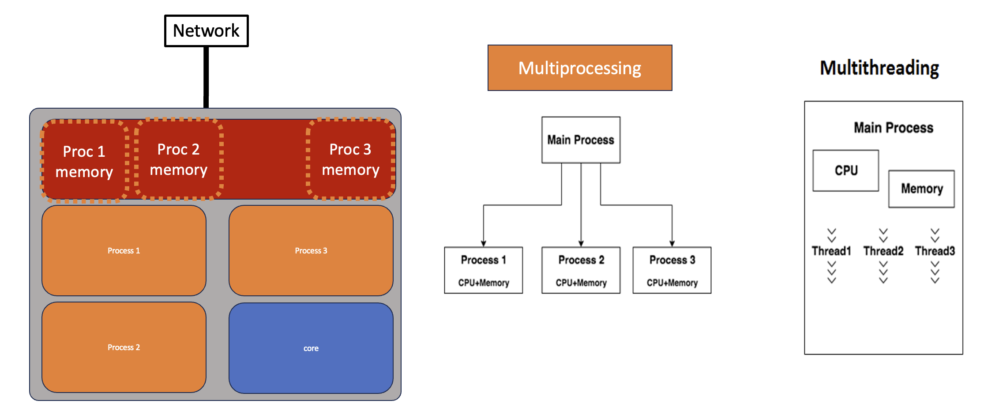

:::questions
- What is the Global Interpreter Lock (GIL)?
- How do I use multiple threads in Python?
:::

:::objectives
- Understand the GIL.
- Understand the difference between the python `threading` and `multiprocessing` library
:::

# A bit of computer architecture
### The von Neumann architecture


- A processing unit with both an arithmetic logic unit and processor registers
- A control unit that includes an instruction register and a program counter
- Memory that stores data and instructions
- External mass storage
- Input and output mechanisms

### Simple multi-core cpu architecture


# The Python Interpreter



- Python source code is compiled into bytecode, the internal representation of a Python program in the interpreter. 
- The bytecode is also cached in .pyc and .pyo files so that executing the same file is faster the second time (recompilation from source to bytecode can be avoided). 
- This “intermediate language” is said to run on a virtual machine that executes the machine code corresponding to each bytecode.


# The Global Interpreter Lock

The Global Interpreter Lock (GIL) is an infamous feature of the Python interpreter. In CPython, theGIL, is a mutex that protects access to Python objects, preventing multiple threads from executing Python bytecodes at once. The GIL prevents race conditions and ensures thread safety, making programming in Python safer, and prevents us from using multiple cores from a single Python instance.



When we want to perform parallel computations, this becomes an obvious problem.
There are roughly two classes of solutions to circumvent/lift the GIL:

- Run multiple Python instances: `multiprocessing`
- Have important code outside Python: OS operations, C++ extensions, cython, numba


# Multithreading, Multiproccessing and Python


## Multithreading


Another possibility for parallelization is to use the `threading` module.
This module is built into Python. In this section, we'll use it to estimate pi
once again.

Using threading to speed up your code:

```python
from threading import (Thread)
```

```python
%%time
n = 10**7
t1 = Thread(target=calc_pi, args=(n,))
t2 = Thread(target=calc_pi, args=(n,))

t1.start()
t2.start()

t1.join()
t2.join()
```

:::discussion
### Discussion: where's the speed-up?
While mileage may vary, parallelizing `calc_pi`, `calc_pi_numpy` and `calc_pi_numba` this way will
not give the expected speed-up. `calc_pi_numba` should give *some* speed-up, but nowhere near the
ideal scaling over the number of cores. This is because Python only allows one thread to access the
interperter at any given time, a feature also known as the Global Interpreter Lock.
:::


### The GIL in action

The downside of running multiple Python instances is that we need to share program state between different processes.
To this end, you need to serialize objects. Serialization entails converting a Python object into a stream of bytes,
that can then be sent to the other process, or e.g. stored to disk. This is typically done using `pickle`, `json`, or
similar, and creates a large overhead.
The alternative is to bring parts of our code outside Python.
Numpy has many routines that are largely situated outside of the GIL.
The only way to know for sure is trying out and profiling your application.

To write your own routines that do not live under the GIL there are several options: fortunately `numba` makes this very easy.

We can force the GIL off in Numba code by setting `nogil=True` in the `numba.jit` decorator.

```python
@numba.jit(nopython=True, nogil=True)
def calc_pi_nogil(N):
    M = 0
    for i in range(N):
        x = random.uniform(-1, 1)
        y = random.uniform(-1, 1)
        if x**2 + y**2 < 1:
            M += 1
    return 4 * M / N
```

The `nopython` argument forces Numba to compile the code without referencing any Python objects,
while the `nogil` argument enables lifting the GIL during the execution of the function.

:::callout
## Use `nopython=True` or `@numba.njit`
It's generally a good idea to use `nopython=True` with `@numba.jit` to make sure the entire
function is running without referencing Python objects, because that will dramatically slow
down most Numba code.  There's even a decorator that has `nopython=True` by default: `@numba.njit`
:::

Now we can run the benchmark again, using `calc_pi_nogil` instead of `calc_pi`.

:::challenge
### Exercise: try threading on a Numpy function
Many Numpy functions unlock the GIL. Try to sort two randomly generated arrays using `numpy.sort` in parallel.

::::solution
### Solution
```python
rnd1 = np.random.random(high)
rnd2 = np.random.random(high)
%timeit -n 10 -r 10 np.sort(rnd1)
```

```python
%%timeit -n 10 -r 10
t1 = Thread(target=np.sort, args=(rnd1, ))
t2 = Thread(target=np.sort, args=(rnd2, ))

t1.start()
t2.start()

t1.join()
t2.join()
```
::::
:::

## Multiprocessing

Python also allows for using multiple processes for parallelisation
via the `multiprocessing` module.  It implements an API that is
superficially similar to threading. For example some pseudo code comparison may look almost identical:
#### Multithreading example
```python
t1 = Thread(target=np.sort, args=(rnd1, ))
```
#### Multiprocessing example
```python
p1 = Process(target=calc_pi, args=(n,))
```

However under the hood processes are very different from threads.  A
new process is created by creating a fresh "copy" of the python
interpreter, that includes all the resources associated to the parent.
There are three different ways of doing this (*spawn*, *fork*, and
*forkserver*), which depends on the platform.  We will use *spawn* as
it is available on all platforms, you can read more about the others
in the [Python
documentation](https://docs.python.org/3/library/multiprocessing.html#contexts-and-start-methods).
As creating a process is resource intensive, multiprocessing is
beneficial under limited circumstances - namely, when the resource
utilisation (or runtime) of a function is *measureably* larger than
the overhead of creating a new process.



The code for computing pi would then look like:

```python
from multiprocessing import Process

def calc_pi(N):
    ...

if __name__ == '__main__':
    n = 10**7
    p1 = Process(target=calc_pi, args=(n,))
    p2 = Process(target=calc_pi, args=(n,))

    p1.start()
    p2.start()

    p1.join()
    p2.join()
```

:::callout
## Protect process creation with an `if`-block
A module should be safely importable.  Any code that creates
processes, pools, or managers should be protected with:
```python
if __name__ == "__main__":
    ...
```
:::

The non-intrusive and safe way of starting a new process is acquire a
`context`, and working within the context.  This ensures your
application does not interfere with any other processes that might be
in use.

```python
import multiprocessing as mp

def calc_pi(N):
    ...

if __name__ == '__main__':
    # mp.set_start_method("spawn")  # if not using a context
    ctx = mp.get_context("spawn")
	...
```

## Passing objects and sharing state
We can pass objects between processes by using `Queue`s and `Pipe`s.  Multiprocessing queues behave similarly to regular queues:
- FIFO: first in, first out
- `queue_instance.put(<obj>)` to add
- `queue_instance.get()` to retrieve

:::challenge
## Exercise: reimplement `calc_pi` to use a queue to return the result

::::solution
## Solution
```python
import multiprocessing as mp
import random


def calc_pi(N, que):
    M = 0
    for i in range(N):
        # Simulate impact coordinates
        x = random.uniform(-1, 1)
        y = random.uniform(-1, 1)

        # True if impact happens inside the circle
        if x**2 + y**2 < 1.0:
            M += 1
    que.put((4 * M / N, N))  # result, iterations


if __name__ == "__main__":
    ctx = mp.get_context("spawn")
    que = ctx.Queue()
    n = 10**7
    p1 = ctx.Process(target=calc_pi, args=(n, que))
    p2 = ctx.Process(target=calc_pi, args=(n, que))
    p1.start()
    p2.start()

    for i in range(2):
        print(que.get())

    p1.join()
    p2.join()
```
::::
:::

:::callout
## Sharing state
It is also possible to share state between processes.  The simpler
of the several ways is to use shared memory via `Value` or `Array`.
You can access the underlying value using the `.value` property.
Note, in case you want to do an operation that is not atomic (cannot
be done in one step, e.g. using the `+=` operator), you should
explicitly acquire a lock before performing the operation:

```python
with var.get_lock():
    var.value += 1
```

Since Python 3.8, you can also create a numpy array backed by a
shared memory buffer
([`multiprocessing.shared_memory.SharedMemory`](https://docs.python.org/3/library/multiprocessing.shared_memory.html)),
which can then be accessed from separate processes *by name*
(including separate interactive shells!).
:::

## Process pool
The `Pool` API provides a pool of worker processes that can execute
tasks.  Methods of the pool object offer various convenient ways to
implement data parallelism in your program.  The most convenient way
to create a pool object is with a context manager, either using the
toplevel function `multiprocessing.Pool`, or by calling the `.Pool()`
method on the context.  With the pool object, tasks can be submitted
by calling methods like `.apply()`, `.map()`, `.starmap()`, or their
`.*_async()` versions.

:::challenge
## Exercise: adapt the original exercise to submit tasks to a pool
- Use the original `calc_pi` function (without the queue)
- Submit batches of different sample size (different values of `N`).
- As mentioned earlier, creating a new process has overhead.  Try a
wide range of sample sizes and check if runtime scaling supports
that claim.

::::solution
## Solution
```python
from itertools import repeat
import multiprocessing as mp
import random
from timeit import timeit


def calc_pi(N):
    M = 0
    for i in range(N):
        # Simulate impact coordinates
        x = random.uniform(-1, 1)
        y = random.uniform(-1, 1)

        # True if impact happens inside the circle
        if x**2 + y**2 < 1.0:
            M += 1
    return (4 * M / N, N)  # result, iterations


def submit(ctx, N):
    with ctx.Pool() as pool:
        pool.starmap(calc_pi, repeat((N,), 4))


if __name__ == "__main__":
    ctx = mp.get_context("spawn")
    for i in (1_000, 100_000, 10_000_000):
        res = timeit(lambda: submit(ctx, i), number=5)
        print(i, res)
```
::::
:::

:::keypoints
- If we want the most efficient parallelism on a single machine, we need to circumvent the GIL.
- If your code releases the GIL, threading will be more efficient than multiprocessing.
- If your code does not release the GIL, some of your code is still in Python, and you're wasting precious compute time!
:::

